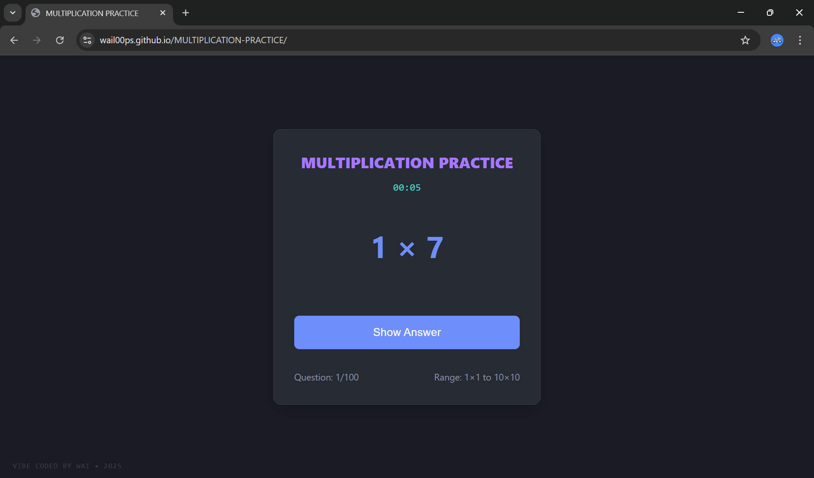

# MULTIPLICATION PRACTICE

 <!-- Add a screenshot later -->

A minimal, dark-mode multiplication practice app with automatic progression. Perfect for basic multiplication practice.

## Live Preview
➡️ Try it now: https://wail00ps.github.io/MULTIPLICATION-PRACTICE/

## Features
- Random multiplication problems (from `1×1` to `10×10`)
- Clean dark theme for better focus and less eye strain
- Auto-advances to the next question after 1 second
- Keyboard support — press `Space` or `Enter` to reveal the answer
- Session timer that tracks total time spent
- Mobile-responsive design for learning on the go
- Auto-reset after completing 100 questions with a completion message

---

**Vibe Coded by WAI • 2025**
